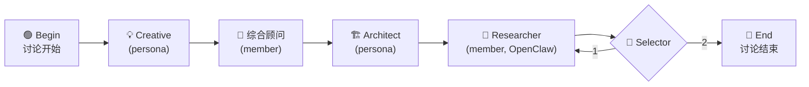

# Example Team: demo_team

What a small team looks like as a **package** — the folder you would put in a snapshot zip, a preset, or write by hand before running `clawcross team import demo_team`. After the import, the members are registered in ClawCross and the two member files are gone from the folder; see [team-anatomy.md](./team-anatomy.md) for the running shape.

## Folder Structure

```
demo_team/
├── internal_agents.json          # WeBot members (import format)
├── external_agents.json          # members on other platforms (import format)
├── oasis_experts.json            # persona prompts (NOT agents)
└── oasis/
    └── yaml/
        └── demo_team_workflow.yaml
```

---

## File Contents

### internal_agents.json

WeBot members. `name` is the member's role name in the team, `tag` the persona it wears, `is_primary` marks the lead. No `session`: importing creates each agent's session.

```json
[
  { "name": "综合顾问",   "tag": "synthesis", "is_primary": true },
  { "name": "coder",      "tag": "coder" },
  { "name": "🏗️ 架构师", "tag": "architect" }
]
```

---

### external_agents.json

Members on other platforms: `platform` says which runtime, `global_name` is the agent's name there (an OpenClaw agent must already exist in OpenClaw). `meta` may carry `api_url` / `model` / `headers`; a package never carries an `api_key`.

```json
[
  { "name": "Researcher",     "tag": "data",     "platform": "openclaw", "global_name": "demo_team_researcher" },
  { "name": "Codex Reviewer", "tag": "critical", "platform": "codex",    "global_name": "codex_reviewer" }
]
```

---

### oasis_experts.json

The team's **persona library** — each entry is a prompt, looked up by `tag`, used by members that wear it and by `persona: <tag>` steps in workflows.

Optional per-persona model override fields (`model`, `api_key`, `base_url`, `provider`) let personas use different LLM providers; when omitted the global `LLM_*` settings apply.

```json
[
  {
    "name": "🏗️ 架构师",
    "tag": "architect",
    "persona": "You are an experienced software architect with deep expertise in system design, microservices, cloud-native architecture, and scalability patterns. You provide high-level technical guidance, evaluate trade-offs between different architectural approaches, and help teams make informed decisions about technology stacks.",
    "temperature": 0.4
  },
  {
    "name": "GPT-5 创意顾问",
    "tag": "creative",
    "persona": "You are a creative brainstorming expert who generates innovative ideas...",
    "temperature": 0.9,
    "model": "gpt-5.4",
    "base_url": "https://api.openai.com",
    "provider": "openai"
  }
]
```

---

### oasis/yaml/demo_team_workflow.yaml

A pipeline mixing temporary personas, a WeBot member, an OpenClaw member and a selector:

```yaml
# creative → synthesis → architect → researcher → selector
version: 2
repeat: false
plan:
- id: on7
  manual:
    author: begin
    content: 讨论开始
- id: on2
  persona: creative              # temporary expert, gone when the topic ends
- id: on1
  agent: 综合顾问                 # member (WeBot), keeps its memory
- id: on3
  persona: architect
- id: on4
  agent: Researcher              # member (OpenClaw) — written the same way
- id: on5
  selector: true
  persona: critical
- id: on6
  manual:
    author: bend
    content: 讨论结束
edges:
- [on7, on2]
- [on2, on1]
- [on1, on3]
- [on3, on4]
- [on4, on5]
selector_edges:
- source: on5
  choices:
    '1': on4
    '2': on6
```

---

## Workflow Visualization



## Notes

- **Import once**: `clawcross team import demo_team` (or installing / uploading the package) registers the members and consumes `internal_agents.json` / `external_agents.json`. Exporting the team writes them again in this shape.
- **Personas vs members**: `oasis_experts.json` is a prompt collection, not an agent registry. A member wears a persona through its `tag`; a workflow names members by role (`agent: <role>`) and temporary experts by tag (`persona: <tag>`).
- **Workflow node types**:
  - `agent: <role>` — a team member speaks (any platform)
  - `persona: <tag>` — a temporary expert wearing that persona (`tools:` optional)
  - `selector: true` — a branching node that routes to different paths
  - `manual: { author: begin/bend }` — start/end markers
